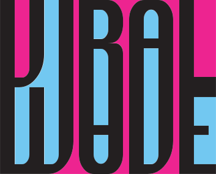
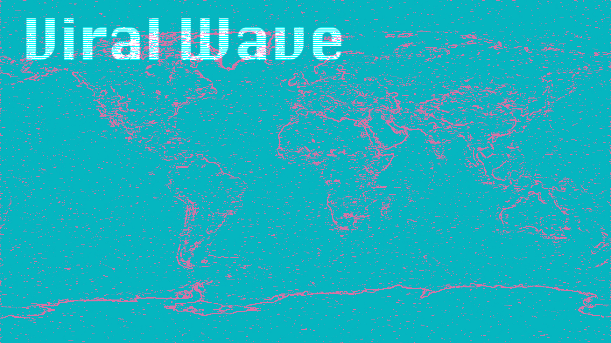
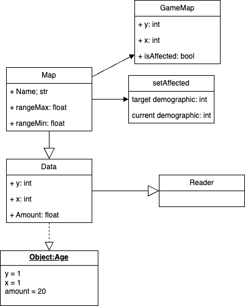

 
# Members
####

* Eli Slovik (Main Programmer): Helps with GUI, getting data for demographics, and helps with coding some logic

* Aidan Slovik (Graphics Programmer, and Data Collector): Will design our hard coded maps, and will help Peter with making randomly generated maps

* Jialai Ying (GUI/Flexible Programmer): Will be the main programmer of our GUI  

* Cormac Stone (Inheritance Programmer): Will be the main programmer for setting up Inheritance and will focuse on the Trends Class

* Owen Madsen (Project Manager, Programmer, and Team Support): Will work on the Upgrades (Bill Boards, Magazines, Social Media) , while also helping with GUI when needed

* Peter Klehr (Data, Graphic Designer, and Map Programmer): Will research data on demographics for the hard coded map of SLC, will also intergrate the data onto the map

## Current Projects

krungthep

-Peter Klehr

Trend game

* Trend Game is simulation like game that will give the user the choice of five different trends, and their goal will be to try and spread it over the entire map.
* Trend Game will have a hard coded map of SLC, and will also be able to generate random maps.
* In Trend Game the user will use upgrades, such as Enhancers; which will give them a boost in their spread rate, and Spreaders; which will allow them to spread to certain .Demographics and will boost the spread rate for those demographics.
* The starting spread rate and the ability to spread to certain demographics will be decided by the Trend the user chooses at the start.
* The hard coded map will have real data on demographics in SLC, this data will be intregated by a grid that is placed over the map.
* Maps will show where and how dense the spread of the trend is, using colors that will represent "Heat".
* The random map will be created by randomizing the grid , each demographic will have their own square on the grid, and will be defined by color.
* Trend Game will be a Real-time Strategy game, The usual time to beat a map will be around 8-15 minutes depending on the users strategy.
* The goal of the user is to find the optimal Strategy for each trend, and map.
* Trend Game's goal is to provide a fun experience for the user, while also teaching them about the spread of trends/things, and how demographics, social media and society in general, affects this.

### Class Diagrams, GUI Mockups, Demos, and more

Class Diagram (Work in Progress)
.drawio.png?raw=true)
Class Diagram File
.drawio)

Map Class Diagram

GUI Mockups

https://hdpulse.nimhd.nih.gov/data-portal/social/map?age=001&age_options=ageall_1&demo=00007&demo_options=poverty_3&race=00&race_options=race_7&sex=0&sex_options=sexboth_1&socialtopic=080&socialtopic_options=social_6&statefips=49&statefips_options=area_states (

https://fred.stlouisfed.org/release/tables?eid=329573&rid=430

https://www.census.gov/quickfacts/fact/table/millcreekcityutah,saltlakecitycityutah/PST045224

https://freevectormaps.com/united-states/utah/US-UT-EPS-01-0002?ref=atr
https://docs.oracle.com/javase/8/docs/api/java/util/HashSet.html
